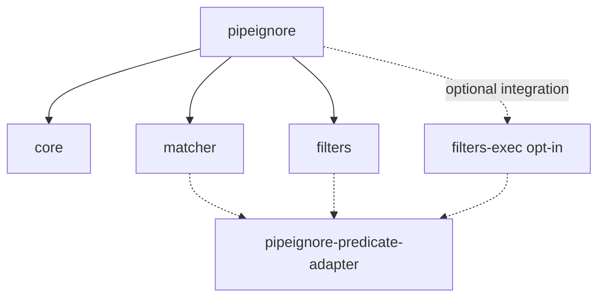

# PipeIgnore Canonical Implementation Specifications 1.0

- **Status:** Draft
- **Version:** 1.0
- **Language:** Language-agnostic

These specifications define the expected architecture and public behavior of the
canonical PipeIgnore implementation family.

They do not prescribe a programming language, package manager, module format,
filesystem API, process API, or asynchronous programming model.

Language-specific implementations MAY expose idiomatic APIs in addition to the
abstract interfaces defined here, provided that their observable semantics
remain equivalent.

The canonical implementation is composed of the following modules:

```text
pipeignore
pipeignore-core
pipeignore-matcher
pipeignore-filters
pipeignore-filters-exec
pipeignore-predicate-adapter
```

Their dependency graph is:



`pipeignore-filters-exec` is opt-in. It is not a dependency of
`pipeignore-filters`.

`pipeignore-core` MUST NOT depend directly upon `pipeignore-matcher`,
`pipeignore-filters`, or `pipeignore-filters-exec`.

Dependencies are supplied to Core through dependency injection.
